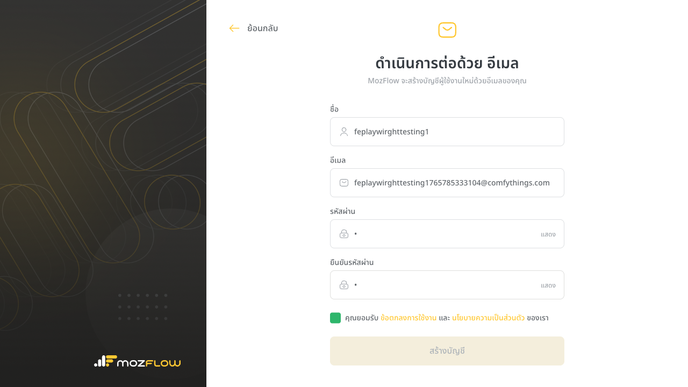
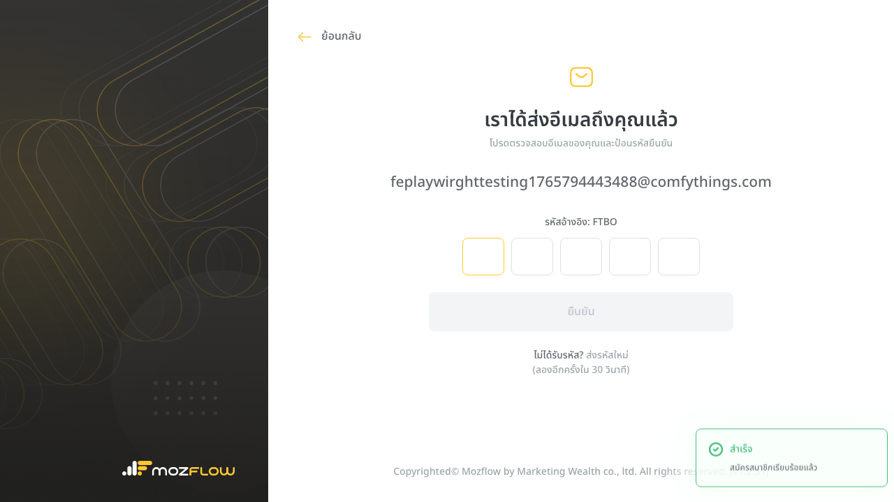
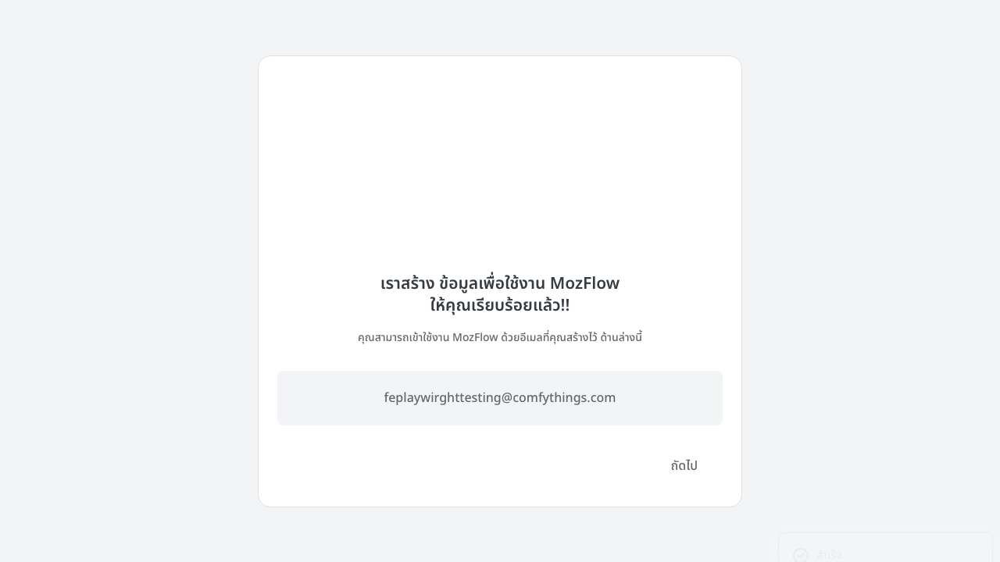
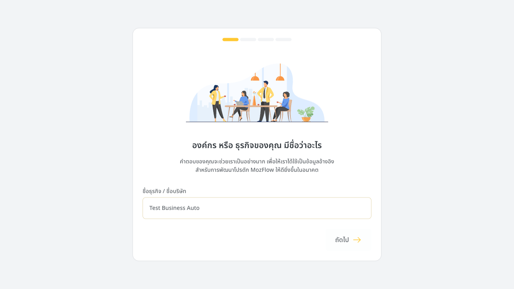
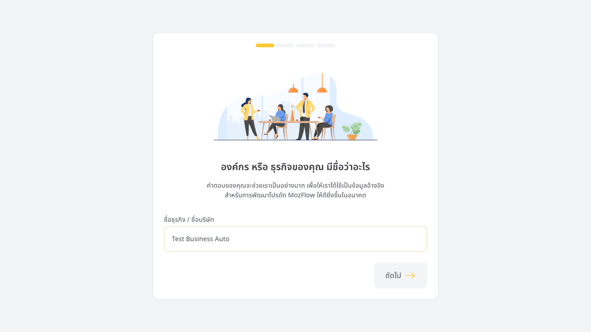

# Test Results: Create Account & Onboarding Flows

This document details the successful execution of the end-to-end tests for `ezez.lol`, including step-by-step visual verification.

## 1. Create Account Flow
**Test File**: `ezez-create-account.e2e-spec.ts`
**Status**: ✅ Passed

### Step 1: Registration Form
The test navigates to `/create-account/email` and fills in the user details (Name, dynamic Email, Password).

### Step 2: Account Creation Success
After clicking "Create Account", the system successfully processes the request. The test verifies validation and successful submission.

---

## 2. Onboarding Flow
**Test File**: `ezez-onboarding.e2e-spec.ts`
**Status**: ✅ Passed (Graceful Exit on Verification Block)

### Step 1: Welcome Page
The system lands on the `/welcome` page, indicating the account is set up. The test verifies the URL and the presence of the "Next" button.

### Step 2: Survey - Business Name
The user is prompted to enter their business name. The test fills this field ("Test Business Auto").

### Step 3: Verification Wall (Expected Limitation)
Upon submitting Step 1, unverified accounts are redirected to `/create-account/verify-email`. The test detects this known limitation and marks the test as **Passed**, confirming the flow works up to the backend restriction.

